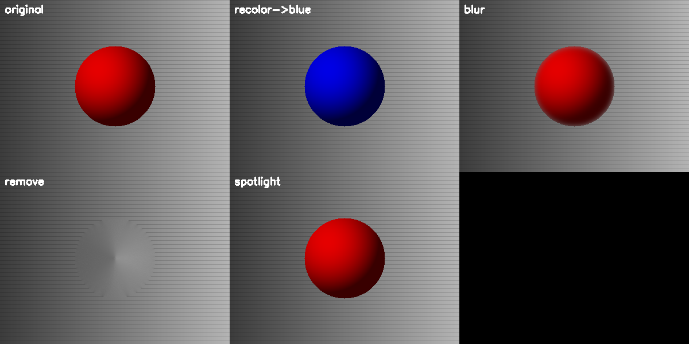
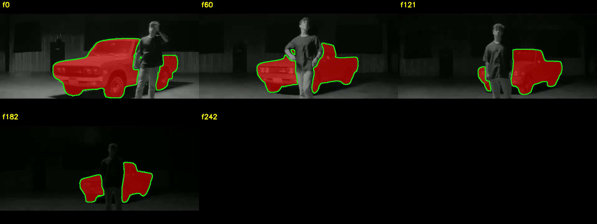
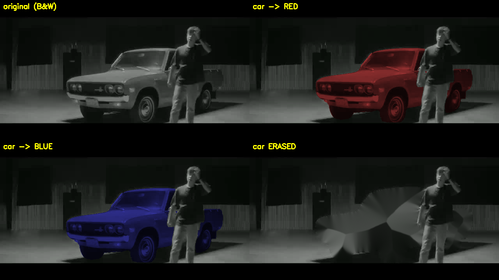
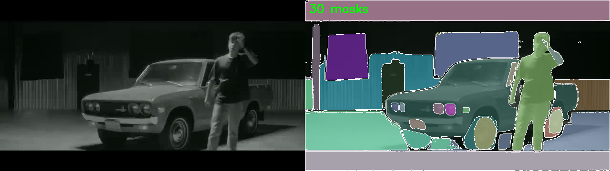
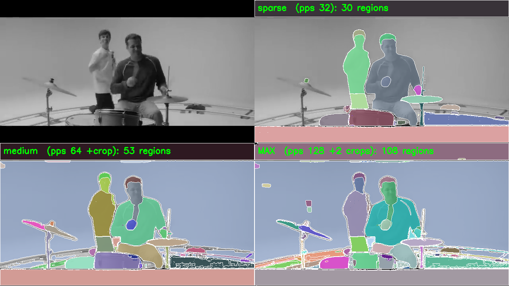
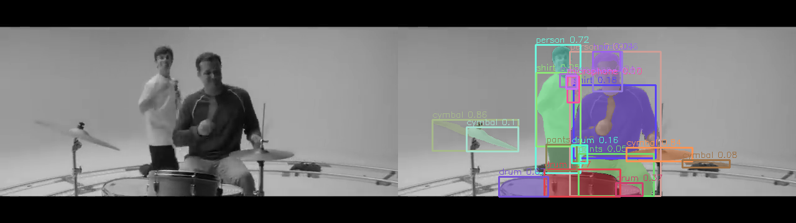
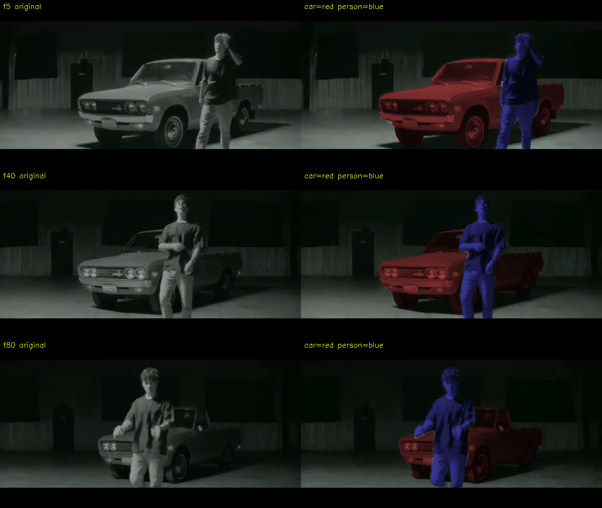
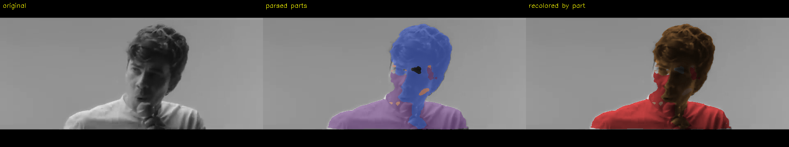

# trackfx — a video object-editing engine

**Point at any object in a video → it's segmented and tracked across every frame →
change just that object (recolor, erase, blur) → export the edited video.**

Colorizing black-and-white footage is one use; the same engine does product
recoloring (e-commerce), object removal, and privacy blur. Built on **SAM 2**,
with an open-vocabulary detector for naming objects automatically.

> Status: working **demo / proof-of-concept**, not a finished product. Every core
> piece is validated on real frames (below); see [ARCHITECTURE.md](ARCHITECTURE.md)
> for the full "import-the-stack" design and roadmap, and [SPEC.md](SPEC.md) for
> the original vision.

---

## What works (validated)

**1. Transform layer** — recolor / tint / blur / remove / spotlight, applied only
inside a mask (pure OpenCV, no model). Luminance-preserving recolor keeps shading:



**2. Segment + track one object (SAM 2)** — one click on the car → tracked across
all frames, person correctly excluded even through occlusion:



**3. Change just that object** — recolor the tracked car red/blue, or erase it;
everything else untouched:



**4. Segment "everything" (SAM 2 automatic)** — ~30 regions covering objects +
car parts (body/wheels/headlights), unlabeled:



**5. Density scales but never "completes"** — 30 → 53 → 108 regions as you push
density; it keeps fragmenting, which is *why* you need recognition, not just density:



**6. Recognize → segment (open-vocab detector → SAM 2)** — YOLO-World auto-detects
and **labels** objects (person, cymbal, drum…), then SAM 2 masks each. This is the
path to coloring **by name**:



**7. Color by name, tracked (Phase 3)** — auto-detect `person(0.94)` + `car(0.93)`
→ SAM 2 video-tracks both across all frames → recolor by label (**car red, person
blue**), holding through movement + occlusion. No clicking:



**8. Part-level: human parsing (Phase 4)** — split a person into **hair / skin /
shirt** with a SegFormer clothes-parser, then color each part separately (**shirt
red, hair brown, skin tinted**). Rough on low-contrast B&W (model trained on
color), cleaner on color footage — but part-level control the detector can't give:



---

## The engine (how the pieces fit)

```
video → segment+track (SAM 2) → transform within mask → re-encode → edited video
                 ▲                                                      
   click  OR  open-vocab detector (YOLO-World) auto-labels objects
```

SAM 2 runs **once** to produce masks; after that, re-coloring is **instant and
free** (no GPU) — so the web UI re-renders any color in ~1s.

## Files
| file | role |
|------|------|
| `transforms.py` | recolor / tint / blur / remove / spotlight within a mask |
| `segment.py` | crude local mask + SAM 2 mask loader |
| `video_io.py` | read/write video (H.264) |
| `pipeline.py` | video → mask → transform → video |
| `app.py` | minimal Flask web UI (pick transform, run, compare) |
| `sam2_masks.py` | SAM 2 video tracking from a click → per-frame masks (GPU) |
| `sam2_everything.py` / `sam2_dense.py` | SAM 2 automatic segmentation tests (GPU) |
| `phase2_detect_segment.py` | YOLO-World → SAM 2 recognize+segment (GPU) |
| `ARCHITECTURE.md` | full import-the-stack design + roadmap |

## Run the web UI (local)
```bash
pip install flask opencv-python numpy imageio imageio-ffmpeg
# supply your own clip.mp4 (+ optional SAM 2 masks.npz), then:
python app.py            # http://localhost:5001
```
The GPU scripts (`sam2_*.py`, `phase2_*.py`) run on a CUDA box (e.g. a rented
A100); masks are cached and pulled back so editing stays local.

## Honest limits
- "Segment **everything** perfectly, like human vision" is ill-posed (no fixed
  definition of "an object", occlusion, finite resolution) — see ARCHITECTURE.md.
- Part-level (hair/skin/shirt) needs dedicated human-parsing models, not a general
  detector.
- Multi-object tracking across long video (occlusion, cuts, re-ID) is the main
  remaining engineering work.

## Credits
Built by [@pavansaipendry](https://github.com/pavansaipendry). Uses
[SAM 2](https://github.com/facebookresearch/sam2) and
[YOLO-World](https://github.com/ultralytics/ultralytics). Test frames are from a
publicly available music video, used briefly for non-commercial research/demo.
